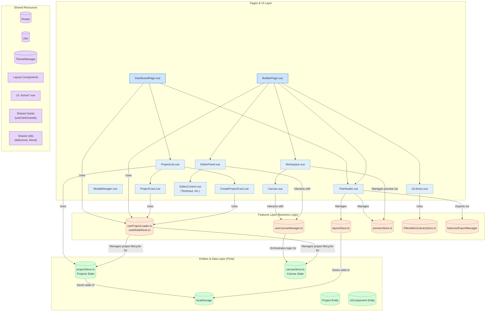
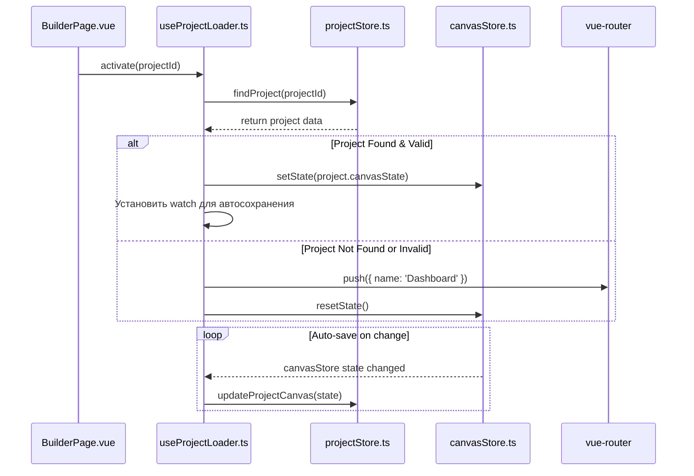
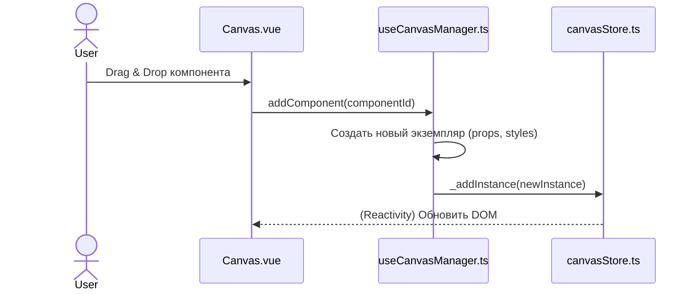
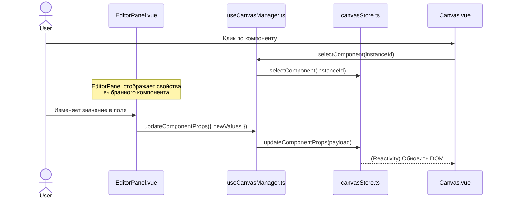
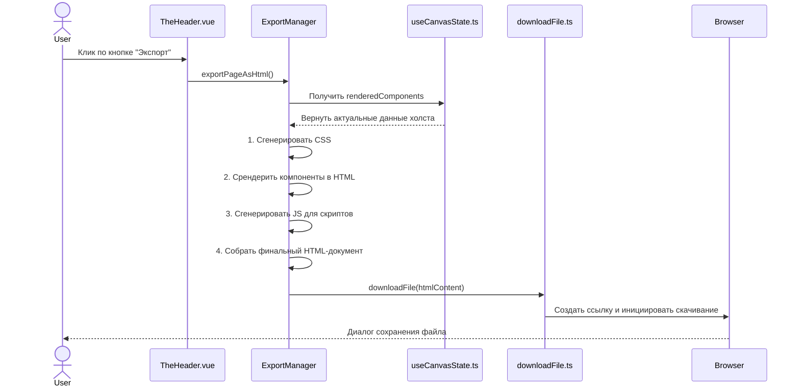

# Архитектура Приложения "Web Builder"

Этот документ описывает высокоуровневую архитектуру веб-конструктора, иллюстрируя ключевые компоненты, их взаимодействие и потоки данных в приложении.

## UML Диаграмма (Mermaid)

## Описание Архитектурных Слоев

### 1. Слой Представления (UI Layer)

Этот слой отвечает за всё, что видит и с чем взаимодействует пользователь. Компоненты этого слоя не содержат сложной бизнес-логики, а делегируют её обработку слою фичей.

-   **Страницы (`pages`)**:
    -   `DashboardPage.vue`: Главная страница для управления проектами. Отображает `ProjectList`.
    -   `BuilderPage.vue`: Основная страница-конструктор. Компонует основные виджеты (`TheHeader`, `UiLibrary`, `Workspace`, `EditorPanel`) и делегирует логику загрузки/сохранения хуку `useProjectLoader`.

-   **Виджеты (`widgets`)**:
    -   `TheHeader.vue`: Верхняя панель приложения. Управляет навигацией, темами, языком, режимом редактирования лэйаута и запуском экспорта.
    -   `ProjectList.vue`: Отображает список проектов (`ProjectCard`) и карточку создания нового проекта.
    -   `UiLibrary.vue`: Панель с библиотекой компонентов, использующая виртуализацию (`@tanstack/vue-virtual`) для высокой производительности.
    -   `Workspace.vue`: Центральная рабочая область, управляющая режимами предпросмотра (`desktop`, `tablet`, `mobile`). Содержит `Canvas`.
    -   `Canvas.vue`: Холст, куда пользователи перетаскивают компоненты. Взаимодействует с фасадом `useCanvasManager`.
    -   `EditorPanel.vue`: Панель свойств выбранного компонента.
    -   `ModalManager.vue`: Глобальный обработчик для отображения модальных окон, таких как `CreateProjectModal` и `ConfirmModal`.

### 2. Слой Фичей (Features Layer)

Это "мозговой центр" приложения, инкапсулирующий бизнес-логику и изолирующий UI от прямого манипулирования данными. Реализован через Vue Composables (фасады) и Pinia-сторы с логикой.

-   **`ProjectFacade`**: Объединяет хуки `useProjectLoader` для управления жизненным циклом проекта (загрузка, автосохранение) и `useModalStore` для управления модальными окнами (создание, удаление).
-   **`CanvasFacade (useCanvasManager.ts)`**: Фасад для работы с холстом. Предоставляет для UI-слоя простой API (`addComponent`, `updateComponentProps`), инкапсулируя сложную логику взаимодействия с `canvasStore`.
-   **`LayoutFacade (layoutStore.ts)`**: Управляет состоянием и логикой кастомизируемого интерфейса (положение и размеры панелей).
-   **`PreviewFacade (previewStore.ts)`**: Управляет режимом предпросмотра холста (десктоп, планшет, мобильный).
-   **`LibraryFeature (FilterableUiLibraryStore.ts)`**: Содержит логику для поиска и фильтрации в библиотеке компонентов с использованием `fuse.js`.
-   **`ExportFeature`**: Изолированный модуль, отвечающий исключительно за экспорт проекта в HTML, CSS и JS.

### 3. Слой Сущностей и Данных (Entities & Data Layer)

Этот слой отвечает за хранение "сырого" состояния (raw state) и определение структуры данных.

-   **`ProjectStore.ts`**: Pinia-стор, хранит массив всех проектов. Использует `pinia-plugin-persistedstate` для сохранения в `localStorage` и систему миграций для обновления структуры.
-   **`CanvasStore.ts`**: "Глупый" Pinia-стор, хранит только состояние холста: массив экземпляров компонентов, их `props`, `styles`, `scripts` и ID выбранного элемента.
-   **`Project (Entity)`**: Типизация, описывающая структуру проекта.
-   **`UiComponent (Entity)`**: Ключевая бизнес-сущность. Описывает метаданные компонента, его Vue-реализацию, стили по умолчанию и конфигурацию для редактора.
-   **UI-сущности**: `ProjectCard.vue`, `CreateProjectCard.vue` - компоненты, представляющие одну сущность в UI.

### 4. Общие Ресурсы (Shared Layer)

Переиспользуемые модули и утилиты, доступные во всём приложении.

-   **`SharedRouter`**: Конфигурация `vue-router` для навигации между страницами.
-   **`SharedI18n`**: Настройка `vue-i18n` для интернационализации.
-   **`SharedTheme`**: `useThemeManager` для управления темами (светлая/тёмная).
-   **`SharedLayout`**: Компоненты для построения кастомизируемого интерфейса (`LayoutManager`, `LayoutPanel`, `Splitter`).
-   **`SharedHooks`**: Переиспользуемые Vue Composables (`useClickOutside`).
-   **`SharedUtils`**: Набор простых утилит (`debounce`, `klona`, `downloadFile`).
-   **`SharedIcons`**: Централизованная библиотека иконок в виде Vue-компонентов.

## Потоки Данных (Data Flow)

Диаграммы последовательности иллюстрируют, как различные части приложения взаимодействуют друг с другом для выполнения ключевых пользовательских сценариев.

### 1. Загрузка Проекта

-   **`BuilderPage.vue`** (UI) при монтировании активирует **`useProjectLoader.ts`** (Logic), передавая ID проекта.
-   **`useProjectLoader.ts`** запрашивает "сырые" данные проекта из **`projectStore.ts`** (Data).
-   Если проект найден и его данные валидны, **`useProjectLoader.ts`** инициализирует **`canvasStore.ts`** (Data) состоянием проекта.
-   В противном случае пользователь перенаправляется на главную страницу через **`vue-router`**, а состояние холста сбрасывается вызовом `resetState` в `canvasStore`.
-   **`useProjectLoader.ts`** устанавливает `watch` для отслеживания изменений в **`canvasStore.ts`** и асинхронного сохранения этих изменений обратно в **`projectStore.ts`**.

### 2. Добавление Компонента на Холст

-   Пользователь перетаскивает компонент из библиотеки на **`Canvas.vue`** (UI).
-   **`Canvas.vue`** обрабатывает событие `drop` и вызывает метод `addComponent` из фасада **`useCanvasManager.ts`** (Logic).
-   **`useCanvasManager.ts`** создает новый объект-экземпляр компонента с настройками по умолчанию.
-   Фасад вызывает `action` у **`canvasStore.ts`** (Data), чтобы добавить новый экземпляр в массив.
-   Система реактивности Vue обновляет DOM, и пользователь видит новый компонент на холсте.

### 3. Редактирование Компонента

-   Пользователь кликает на компонент в **`Canvas.vue`**, который вызывает `selectComponent` у **`useCanvasManager.ts`** (Logic).
-   **`EditorPanel.vue`** (UI) реактивно отображает элементы управления для выбранного компонента.
-   При изменении значения в поле (`EditorControl`), **`EditorPanel.vue`** вызывает соответствующий метод (`updateComponentProps` или `updateComponentStyles`) у **`useCanvasManager.ts`**.
-   Фасад делегирует обновление в **`canvasStore.ts`** (Data).
-   Реактивность обновляет вид компонента на холсте.

### 4. Экспорт в HTML

-   Пользователь нажимает кнопку экспорта в **`TheHeader.vue`** (UI).
-   Вызывается функция `exportPageAsHtml` из модуля **`ExportManager`** (Logic).
-   **`ExportManager`** запрашивает актуальное состояние холста через `useCanvasState`.
-   Модуль последовательно генерирует CSS, рендерит Vue-компоненты в статическую HTML-строку (`@vue/server-renderer`), генерирует JS для интерактивности.
-   Собранный HTML-код передается в утилиту **`downloadFile`** (Shared), которая инициирует скачивание файла в браузере.