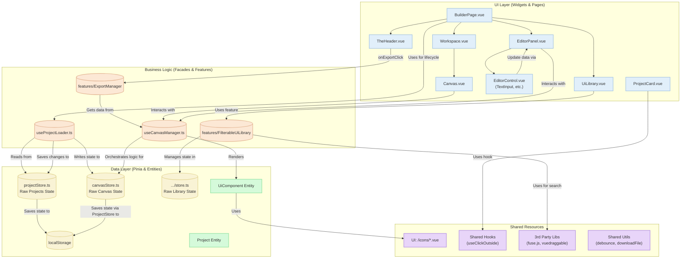

# Архитектура Приложения "Web Builder"

Этот документ описывает высокоуровневую архитектуру созданного нами веб-конструктора. Диаграмма иллюстрирует ключевые компоненты, их взаимодействие и потоки данных в приложении после проведения рефакторинга.

## UML Диаграмма (Mermaid)

## Описание Архитектурных Слоев

### 1. Слой Представления (UI Layer)

Этот слой отвечает за всё, что видит и с чем взаимодействует пользователь. Компоненты этого слоя не содержат сложной бизнес-логики, а делегируют её обработку слою бизнес-логики.

-   **`BuilderPage.vue`**: Основная страница-контейнер. Делегирует всю логику загрузки, сохранения и очистки данных проекта хуку `useProjectLoader`, оставаясь "чистым" компонентом, отвечающим только за компоновку виджетов.
-   **`TheHeader.vue`**: Верхняя панель приложения. Запускает экспорт, управляет режимом редактирования лэйаута и навигацией.
-   **`UiLibrary.vue`**: Виджет с библиотекой компонентов. Использует виртуальный скроллинг (`@tanstack/vue-virtual`) для высокой производительности.
-   **`Canvas.vue`**: Центральная рабочая область, куда пользователи перетаскивают компоненты. Взаимодействует с фасадом `useCanvasManager` для управления своим состоянием.
-   **`EditorPanel.vue`**: Панель свойств выбранного компонента. Декомпозирована на мелкие переиспользуемые контролы.
-   **`EditorControl.vue`**: Универсальный компонент, который рендерит нужный контрол (`TextInput.vue`, `ColorInput.vue` и др.) в зависимости от типа поля.

### 2. Слой Бизнес-Логики (Business Logic Layer)

Это "мозговой центр" приложения, изолирующий UI от прямого манипулирования данными. Реализован через Vue Composables (фасады) и изолированные модули-фичи.

-   **`useCanvasManager.ts`**: **Фасад** для работы с холстом. Предоставляет для UI-слоя простой API (`addComponent`, `updateComponentProps`), инкапсулируя сложную логику взаимодействия с `canvasStore`.
-   **`useProjectLoader.ts`**: Изолированный хук, отвечающий за **жизненный цикл проекта**. Он инкапсулирует логику загрузки данных из `projectStore` в `canvasStore`, их валидацию и последующее автосохранение.
-   **`features/ExportManager`**: Изолированный модуль, отвечающий исключительно за экспорт.
-   **`features/FilterableUiLibrary`**: Фича, содержащая логику для поиска и фильтрации в библиотеке компонентов.

### 3. Слой Данных (Data Layer)

Этот слой отвечает исключительно за хранение "сырого" состояния и определение структуры данных (сущностей).

-   **`canvasStore.ts`**: "Глупый" Pinia-стор, хранит только состояние холста: массив компонентов, ID выбранного и скрипты. Не содержит сложной логики.
-   **`projectStore.ts`**: Аналогичный стор, хранит список всех проектов пользователя. Использует `pinia-plugin-persistedstate` для сохранения в `localStorage`.
-   **`Project (Entity)`**: Сущность, описывающая проект. Ключевое изменение: поле `canvasState` имеет тип `Record<string, any>`, что **устраняет прямую зависимость** от фичи `Canvas`. Валидация этих данных происходит в `useProjectLoader`.
-   **`UiComponent (Entity)`**: Ключевая бизнес-сущность, реализованная по принципу "конфигурация как код". Описывает метаданные, сам Vue-компонент, стили по умолчанию и конфигурацию для панели редактора.

### 4. Общие Ресурсы (Shared Layer)

-   **`shared/lib/hooks`**: Коллекция переиспользуемых Vue Composables, таких как `useClickOutside`, для инкапсуляции общей UI-логики и следования принципу DRY.
-   **`shared/lib/utils`**: Набор простых переиспользуемых утилит (`debounce`, `downloadFile`).
-   **`shared/ui/icons`**: Централизованная библиотека иконок в виде Vue-компонентов.
-   **Сторонние библиотеки**: `fuse.js`, `vuedraggable`, `codemirror` и другие.

## Потоки Данных (Data Flow)

1.  **Загрузка Проекта**:
    -   `BuilderPage.vue` (UI) монтируется и активирует `useProjectLoader` (Logic), передавая ID проекта.
    -   `useProjectLoader` (Logic) запрашивает данные проекта у `projectStore` (Data).
    -   `useProjectLoader` (Logic) **валидирует** полученный `canvasState` на соответствие нужной структуре.
    -   В случае успеха, `useProjectLoader` вызывает экшен `setState` у `canvasStore` (Data), заполняя холст.
    -   `useProjectLoader` (Logic) устанавливает `watch` для автосохранения изменений из `canvasStore` обратно в `projectStore`.

2.  **Добавление компонента на холст**:
    -   Пользователь перетаскивает `UiLibraryItem` (UI).
    -   `Canvas.vue` (UI) ловит событие `drop` и вызывает `addComponent` у фасада `useCanvasManager` (Logic).
    -   `useCanvasManager` (Logic) создает экземпляр компонента и вызывает экшен `_addInstance` у `canvasStore` (Data).
    -   `canvasStore` (Data) обновляет свой массив, что реактивно отображается на холсте.

3.  **Редактирование компонента**:
    -   Пользователь выбирает компонент. `Canvas.vue` (UI) вызывает `selectComponent` у `useCanvasManager` (Logic).
    -   `EditorPanel.vue` (UI) отображает контролы на основе данных из `selectedComponent` (computed-свойство из `useCanvasManager`).
    -   При изменении значения, `EditorPanel.vue` вызывает `updateComponentStyles` или `updateComponentProps` у `useCanvasManager` (Logic).
    -   `useCanvasManager` (Logic) делегирует обновление в `canvasStore` (Data).

4.  **Экспорт в HTML**:
    -   Пользователь нажимает кнопку в `TheHeader.vue` (UI).
    -   Вызывается функция из модуля `ExportManager` (Logic).
    -   `ExportManager` запрашивает актуальные данные `renderedComponents` у `useCanvasManager` (Logic) и генерирует HTML-файл. Логика сторов и холста не затрагивается.