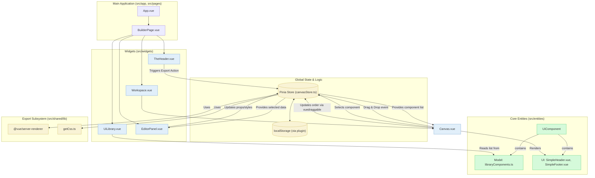

# Архитектура Приложения "Web Builder"

Этот документ описывает высокоуровневую архитектуру созданного нами веб-конструктора. Диаграмма иллюстрирует ключевые компоненты, их взаимодействие и потоки данных в приложении.

## UML Диаграмма (Mermaid)

## Описание Компонентов

### 1. Глобальное Состояние (Pinia)

-   **`canvasStore.ts`**: Это мозг всего приложения. Он является единственным источником правды для состояния холста. В нем хранится:
    -   Массив `componentInstances`, содержащий все компоненты на холсте, их порядок, `props` (контент) и `styles`.
    -   `selectedComponentInstanceId` для отслеживания выбранного компонента.
    -   Все `actions` для манипуляции состоянием: добавление, удаление, обновление, изменение порядка и экспорт.
-   **`localStorage`**: Благодаря плагину `pinia-plugin-persistedstate`, состояние `canvasStore` автоматически сохраняется в `localStorage` браузера, обеспечивая персистентность данных между сессиями.

### 2. Основные Виджеты (Widgets)

-   **`BuilderPage.vue`**: Главный компонент-оркестратор, который формирует базовую трехколоночную структуру приложения.
-   **`TheHeader.vue`**: Шапка приложения, содержит логотип и кнопку "Экспорт".
-   **`UiLibrary.vue`**: Левая панель. Отображает список доступных для добавления компонентов, которые она берет из `libraryComponents.ts`.
-   **`Workspace.vue`**: Центральная область, содержащая `Canvas.vue`.
-   **`Canvas.vue`**: Холст для сборки страницы.
    -   Получает список компонентов из `canvasStore`.
    -   Использует `<Suspense>` для асинхронной отрисовки реальных Vue-компонентов.
    -   Использует `vuedraggable` для управления порядком компонентов.
    -   Отправляет `actions` в стор при выборе или удалении компонента.
-   **`EditorPanel.vue`**: Правая панель.
    -   Подписана на геттер `selectedComponent` из `canvasStore`.
    -   Отображает поля для редактирования контента и стилей выбранного компонента.
    -   При изменении значений в полях отправляет `actions` в стор для обновления `props` или `styles`.

### 3. Сущности (Entities)

-   **`UiComponent`**: Ключевая бизнес-сущность. Она объединяет в себе:
    -   **Модель (`libraryComponents.ts`)**: Массив-конфигурация, который определяет, какие компоненты существуют в библиотеке, их имена и `props` по умолчанию.
    -   **UI (`SimpleHeader.vue`, `SimpleFooter.vue`)**: Реальные `.vue` файлы, которые содержат разметку и стили. Именно они рендерятся и на холсте, и при экспорте.

## Потоки Данных (Data Flow)

1.  **Добавление компонента**: `UiLibrary.vue` инициирует Drag-and-Drop. `Canvas.vue` "ловит" его и вызывает `action` `addComponent` в `canvasStore`.
2.  **Отображение**: `Canvas.vue` реактивно получает обновленный список из `getters` в `canvasStore` и рендерит компоненты.
3.  **Выделение**: Пользователь кликает на компонент в `Canvas.vue`, который вызывает `action` `selectComponent` в `canvasStore`.
4.  **Редактирование**:
    -   `EditorPanel.vue` получает данные о выбранном компоненте из `getters` в `canvasStore`.
    -   Пользователь меняет значение в `input`. `v-model` через `computed`-свойство вызывает `action` `updateComponentProps` или `updateComponentStyles` в `canvasStore`.
    -   `Canvas.vue`, будучи подписанным на изменения, мгновенно перерисовывает обновленный компонент.
5.  **Изменение порядка**: `vuedraggable` в `Canvas.vue` напрямую меняет порядок массива. `computed`-свойство, к которому привязан `v-model`, вызывает `action` `setComponentInstances`, обновляя порядок в `canvasStore`.
6.  **Экспорт**:
    -   Клик по кнопке в `TheHeader.vue` вызывает асинхронный `action` `generateHtmlString`.
    -   Этот `action` итерируется по компонентам из `getters`. Для каждого компонента он:
        -   Использует `@vue/server-renderer` для рендеринга `.vue` файла сущности в HTML-строку.
        -   Применяет пользовательские стили.
    -   Собирает весь CSS страницы с помощью утилиты `getCss`.
    -   Формирует финальный `.html` файл и возвращает его в `TheHeader.vue` для скачивания.