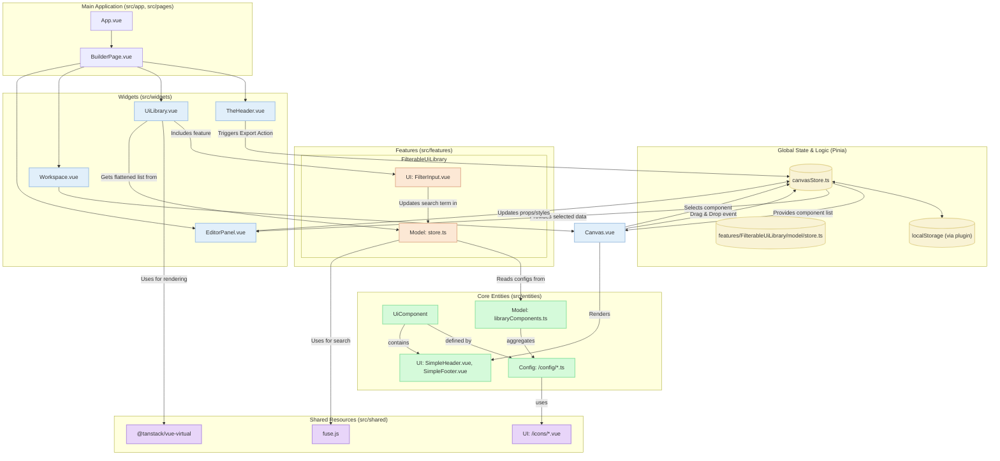

# Архитектура Приложения "Web Builder"

Этот документ описывает высокоуровневую архитектуру созданного нами веб-конструктора. Диаграмма иллюстрирует ключевые компоненты, их взаимодействие и потоки данных в приложении.

## UML Диаграмма (Mermaid)

## Описание Компонентов

### 1. Глобальное Состояние (Pinia)

-   **`canvasStore.ts`**: Мозг приложения, отвечающий за состояние холста. Хранит массив `componentInstances`, `selectedComponentInstanceId` и все `actions` для манипуляции с холстом.
-   **`features/FilterableUiLibrary/model/store.ts`**: Отвечает за состояние панели с компонентами. Хранит исходный список компонентов, поисковый запрос и предоставляет отфильтрованные и **сгруппированные в плоский список** данные для высокопроизводительного виджета. Использует **`fuse.js`** для нечеткого поиска (fuzzy search).
-   **`localStorage`**: Благодаря плагину `pinia-plugin-persistedstate`, состояние `canvasStore` автоматически сохраняется в `localStorage`, обеспечивая персистентность данных между сессиями.

### 2. Features (Фичи)

-   **`FilterableUiLibrary`**: Единая, целостная фича, отвечающая за всю логику библиотеки компонентов.
    -   **Модель (`store.ts`)**: Является единым источником правды для библиотеки, инкапсулируя логику **нечеткого поиска**, фильтрации и преобразования данных в плоский список для виртуализации.
    -   **UI (`FilterInput.vue`)**: UI-компонент, предоставляющий поле ввода для поиска и взаимодействующий со `store` для обновления состояния.

### 3. Основные Виджеты (Widgets)

-   **`UiLibrary.vue` (refactored)**: Левая панель. Этот виджет был кардинально переработан и теперь является **высокопроизводительным**. Вместо простого перебора всех элементов он использует библиотеку **`@tanstack/vue-virtual`** для реализации **виртуального скроллинга**. Это означает, что в DOM рендерятся только видимые пользователю элементы, что гарантирует мгновенную работу интерфейса даже с сотнями компонентов в библиотеке.
-   **`EditorPanel.vue`**: Правая панель для редактирования свойств выбранного компонента. Этот виджет является полностью **управляемым данными (data-driven)** и не содержит логики, специфичной для отдельных компонентов.
-   **Другие виджеты**: `TheHeader.vue`, `Workspace.vue`, `Canvas.vue` формируют остальную структуру приложения.

### 4. Сущности (Entities)

-   **`UiComponent`**: Ключевая бизнес-сущность. Её структура была улучшена для повышения удобства разработки (DX) и гибкости:
    -   **Конфигурация (`/config/*.ts`)**: Описание каждого компонента (его `id`, `props`, `editorTabs` и т.д.) вынесено в отдельный файл конфигурации. Это соответствует Принципу единственной ответственности и упрощает добавление новых компонентов.
    -   **Модель (`libraryComponents.ts`)**: Больше не хранит "сырые" данные, а лишь агрегирует конфигурации из `/config` и создает `Map` для быстрого доступа.
    -   **Иконки (`shared/ui/icons`)**: Иконки для превью в библиотеке теперь являются независимыми компонентами в `shared` слое, что устраняет циклические зависимости и способствует переиспользованию.
    -   **Оптимизация**: Все компоненты, передаваемые в конфигурации, обернуты в `markRaw`, чтобы избежать ненужных накладных расходов на реактивность Vue.

## Потоки Данных (Data Flow)

1.  **Поиск и фильтрация компонентов (new high-performance flow)**:
    -   Пользователь вводит текст в `FilterInput.vue`.
    -   Компонент вызывает `action` `setSearchTerm` в `store`.
    -   `getter` в `store` использует **`fuse.js`** для выполнения нечеткого поиска по списку компонентов.
    -   Другой `getter` `flatListItems` преобразует отфильтрованные и сгруппированные результаты в **плоский массив**, где каждый элемент является либо заголовком категории, либо рядом с компонентами.
    -   `UiLibrary.vue` получает этот плоский массив.
    -   Хук `useVirtualizer` из `@tanstack/vue-virtual` вычисляет, какие элементы из плоского массива видны в данный момент, и передает в шаблон только их.
    -   Шаблон рендерит минимально необходимое количество DOM-узлов, обеспечивая высочайшую производительность.

2.  **Добавление компонента**: Пользователь перетаскивает компонент из `UiLibrary.vue`. `Canvas.vue` "ловит" событие и вызывает `action` `addComponent` в `canvasStore`.

3.  **Выделение и Редактирование**: Поток данных для редактирования остался прежним (data-driven), где `EditorPanel.vue` динамически рендерит поля на основе метаданных `editorTabs` выбранного компонента.