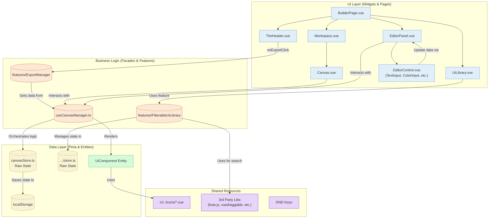

# Архитектура Приложения "Web Builder"

Этот документ описывает высокоуровневую архитектуру созданного нами веб-конструктора. Диаграмма иллюстрирует ключевые компоненты, их взаимодействие и потоки данных в приложении после проведения рефакторинга.

## UML Диаграмма (Mermaid)

## Описание Архитектурных Слоев

### 1. Слой Представления (UI Layer)

Этот слой отвечает за всё, что видит и с чем взаимодействует пользователь. Компоненты этого слоя не содержат сложной бизнес-логики, а делегируют её обработку слою бизнес-логики.

-   **`BuilderPage.vue`**: Основная страница, которая собирает все основные виджеты (`TheHeader`, `UiLibrary`, `AppWorkspace`, `EditorPanel`) в единый макет.
-   **`TheHeader.vue`**: Верхняя панель приложения, содержит логотип и кнопку "Export to HTML", которая запускает процесс экспорта.
-   **`UiLibrary.vue`**: Виджет с библиотекой компонентов. Для высокой производительности использует виртуальный скроллинг (`@tanstack/vue-virtual`), отображая только видимые элементы. Взаимодействует с `FilterableUiLibrary` для поиска и отображения компонентов.
-   **`Canvas.vue`**: Центральная рабочая область, куда пользователи перетаскивают компоненты. Использует `vuedraggable` для изменения порядка компонентов и напрямую взаимодействует с фасадом `useCanvasManager` для управления своим состоянием.
-   **`EditorPanel.vue`**: Панель свойств выбранного компонента. Она декомпозирована на мелкие переиспользуемые контролы (`EditorControl.vue`), что соответствует Принципу единственной ответственности. Взаимодействует с `useCanvasManager` для получения данных и их обновления.
-   **`EditorControl.vue`**: Универсальный компонент, который рендерит нужный контрол (`TextInput.vue`, `ColorInput.vue`, `LinkArrayEditor.vue` и др.) в зависимости от типа поля, переданного из конфигурации. Это позволяет легко расширять набор редакторов.
-   **Иконки**: Все иконки централизованы в `shared/ui/icons` в виде Vue-компонентов, что обеспечивает их переиспользование и чистоту кода виджетов.

### 2. Слой Бизнес-Логики (Business Logic Layer)

Это "мозговой центр" приложения, изолирующий UI от прямого манипулирования данными. Он реализован через Vue Composables (фасады) и изолированные модули-фичи.

-   **`useCanvasManager.ts`**: Ключевой компонент, реализующий паттерн **Фасад**. Он предоставляет для UI-слоя простой и понятный API для работы с холстом. Он инкапсулирует всю сложную логику:
    -   Предоставляет `computed`-свойства (`renderedComponents`, `selectedComponent`), которые обогащают "сырые" данные из `canvasStore` полной информацией о компонентах.
    -   Содержит методы (`addComponent`, `cloneComponent`, `updateComponentProps`), которые оркестрируют изменения состояния, обращаясь к `canvasStore`.
-   **`features/ExportManager`**: Изолированный модуль, отвечающий исключительно за экспорт. Он запрашивает данные у `useCanvasManager`, генерирует HTML, CSS и JS с помощью `@vue/server-renderer` и безопасной "песочницы" и инициирует скачивание файла. Такая изоляция позволяет легко добавлять новые форматы экспорта, не затрагивая ядро приложения.
-   **`features/FilterableUiLibrary`**: Фича, содержащая логику для библиотеки компонентов, включая нечеткий поиск с помощью `fuse.js` и подготовку данных для виртуализированного списка.

### 3. Слой Данных (Data Layer)

Этот слой отвечает исключительно за хранение "сырого" состояния и определение структуры данных.

-   **`canvasStore.ts`**: "Глупый" Pinia-стор, который хранит только массив экземпляров компонентов на холсте (`componentInstances`), ID выбранного (`selectedComponentInstanceId`) и данные скриптов. Он не содержит сложной логики, только простые синхронные экшены для CRUD-операций. Использует `pinia-plugin-persistedstate` для автоматического сохранения состояния в `localStorage`.
-   **`features/FilterableUiLibrary/model/store.ts`**: Аналогичный стор для состояния библиотеки, хранящий поисковый запрос.
-   **`UiComponent` (Entity)**: Ключевая бизнес-сущность, реализованная по принципу "конфигурация как код". Каждый UI-компонент (`SimpleHeader`, `SimpleFooter`) имеет ассоциированный с ним объект конфигурации, который описывает:
    -   Метаданные (id, имя, категория).
    -   Сам Vue-компонент (загружается асинхронно).
    -   Иконку для превью.
    -   Свойства и стили по умолчанию (`defaultProps`, `defaultStyles`).
    -   Структуру вкладок и полей для `EditorPanel` (например, `{ name: 'logoText', type: 'text' }`).
    -   Статические CSS-стили (`staticCss`), которые включаются в финальный экспорт.

### 4. Общие Ресурсы (Shared Layer)

-   **`shared/lib/sandbox`**: Содержит логику для создания безопасной "песочницы" для выполнения пользовательских скриптов, предотвращая доступ к глобальным переменным и защищая от XSS.
-   **`shared/lib/utils`**: Набор простых переиспользуемых утилит, таких как `debounce`.
-   **`shared/ui/icons`**: Централизованная библиотека иконок в виде Vue-компонентов.
-   **Сторонние библиотеки**: `fuse.js`, `vuedraggable`, `codemirror` и другие, которые используются в разных частях приложения.

## Потоки Данных (Data Flow)

1.  **Добавление компонента на холст**:
    -   Пользователь перетаскивает `UiLibraryItem` (UI) из библиотеки.
    -   `Canvas.vue` (UI) ловит событие `drop` и вызывает метод `addComponent` у фасада `useCanvasManager` (Logic), передавая ID компонента.
    -   `useCanvasManager` (Logic) создает новый экземпляр, используя конфигурацию из `UiComponent` (Entity), и вызывает простой экшен `_addInstance` у `canvasStore` (Data).
    -   `canvasStore` (Data) обновляет свой массив `componentInstances`, что реактивно отображается на холсте.

2.  **Редактирование компонента**:
    -   Пользователь выбирает компонент на холсте, `Canvas.vue` вызывает `selectComponent` у `useCanvasManager`.
    -   `EditorPanel.vue` (UI) отображает контролы на основе данных из `selectedComponent`, полученных от `useCanvasManager` (Logic).
    -   При изменении значения в дочернем контроле (например, `TextInput.vue`), он оповещает `EditorControl.vue`, который, в свою очередь, оповещает `EditorPanel.vue`.
    -   `EditorPanel.vue` вызывает `updateComponentStyles` или `updateComponentProps` у `useCanvasManager` (Logic).
    -   `useCanvasManager` (Logic) делегирует это обновление соответствующему экшену в `canvasStore` (Data).

3.  **Экспорт в HTML**:
    -   Пользователь нажимает кнопку в `TheHeader.vue` (UI).
    -   Вызывается функция из модуля `ExportManager` (Logic).
    -   `ExportManager` запрашивает актуальные данные `renderedComponents` у `useCanvasManager` (Logic).
    -   `ExportManager` рендерит каждый компонент в HTML-строку, генерирует динамические CSS-классы для кастомных стилей, агрегирует все статические стили из конфигураций `UiComponent` (Entity) и собирает безопасный JS-код из песочницы.
    -   Сгенерированный HTML-файл предлагается пользователю для скачивания. Логика стора и холста при этом не затрагивается.