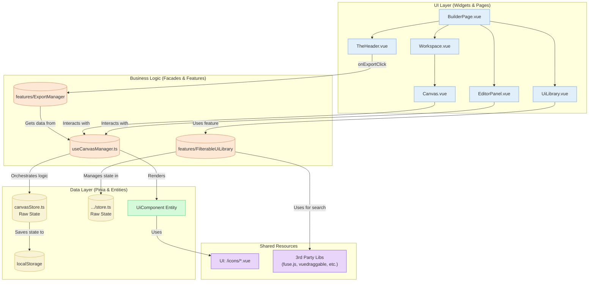

# Архитектура Приложения "Web Builder"

Этот документ описывает высокоуровневую архитектуру созданного нами веб-конструктора. Диаграмма иллюстрирует ключевые компоненты, их взаимодействие и потоки данных в приложении после проведения рефакторинга.

## UML Диаграмма (Mermaid)

## Описание Архитектурных Слоев

### 1. Слой Данных (Data Layer)

Этот слой отвечает исключительно за хранение "сырого" состояния. Он не содержит сложной бизнес-логики.

-   **`canvasStore.ts` (refactored)**: После рефакторинга стор стал предельно простым. Он хранит только массив `componentInstances` и `selectedComponentInstanceId`. Все сложные геттеры и экшены (`addComponent`, `cloneComponent`) были из него удалены. Его задача — быть "глупым" хранилищем данных.
-   **`features/FilterableUiLibrary/model/store.ts`**: Аналогично хранит состояние библиотеки: поисковый запрос и список компонентов.
-   **`UiComponent` (Entity)**: Ключевая бизнес-сущность. Её конфигурация полностью декларативна, а все UI-ресурсы (включая **все иконки**) вынесены в `shared` слой для устранения циклических зависимостей и максимального переиспользования.

### 2. Слой Бизнес-Логики (Business Logic Layer)

Это новый, выделенный слой, который выступает в роли "мозгового центра" приложения. Он изолирует UI от данных.

-   **`useCanvasManager.ts` (new)**: Является **фасадом** для всей логики холста. UI-компоненты (`Canvas.vue`, `EditorPanel.vue`) взаимодействуют только с ним. Он содержит:
    -   `computed`-свойства для получения обогащенных данных (например, `renderedComponents`).
    -   Методы (`addComponent`, `cloneComponent`), которые инкапсулируют всю логику по созданию и модификации экземпляров.
    -   Оркестрирует вызовы к "глупому" `canvasStore` для обновления состояния.
-   **`features/ExportManager` (new)**: Изолированный модуль, отвечающий только за экспорт. Он не является частью `canvasStore`, что позволяет легко добавлять новые форматы экспорта (например, ZIP, React-проект), не затрагивая ядро приложения.
-   **`features/FilterableUiLibrary`**: Содержит логику нечеткого поиска (`fuse.js`) и преобразования данных для виртуализированного списка.

### 3. Слой Представления (UI Layer)

-   **`EditorPanel.vue` (refactored)**: Компонент был улучшен за счет декомпозиции `EditorControl` на мелкие, специализированные компоненты (`TextInput.vue`, `ColorInput.vue` и т.д.), что соответствует **Принципу единственной ответственности**.
-   **`UiLibrary.vue`**: Высокопроизводительный виджет, использующий **`@tanstack/vue-virtual`** для виртуального скроллинга.
-   **Иконки (refactored)**: **Все** иконки были вынесены из виджетов и централизованы в `shared/ui/icons`, что делает код виджетов чище и способствует переиспользованию.

## Потоки Данных (Data Flow)

1.  **Поиск и фильтрация компонентов**:
    -   `FilterInput.vue` -> обновляет `store` библиотеки.
    -   `store` -> использует `fuse.js` -> отдает `UiLibrary.vue` плоский, виртуализированный список.
    -   `@tanstack/vue-virtual` рендерит только видимые элементы.

2.  **Добавление и Редактирование компонента (new facade flow)**:
    -   `Canvas.vue` (UI) вызывает метод `addComponent` у `useCanvasManager` (Logic).
    -   `useCanvasManager` создает новый экземпляр компонента, используя данные из `UiComponent` (Entity).
    -   `useCanvasManager` вызывает простой экшен `_addInstance` у `canvasStore` (Data) для сохранения нового экземпляра.
    -   При редактировании `EditorPanel.vue` вызывает `updateComponentStyles` у `useCanvasManager`, который, в свою очередь, делегирует вызов `canvasStore`.

3.  **Экспорт (new decoupled flow)**:
    -   Пользователь нажимает кнопку в `TheHeader.vue`.
    -   Вызывается функция из модуля `ExportManager`.
    -   `ExportManager` запрашивает актуальные данные `renderedComponents` у `useCanvasManager`.
    -   `ExportManager` генерирует HTML-строку и инициирует скачивание файла. Логика стора и холста не затрагивается.