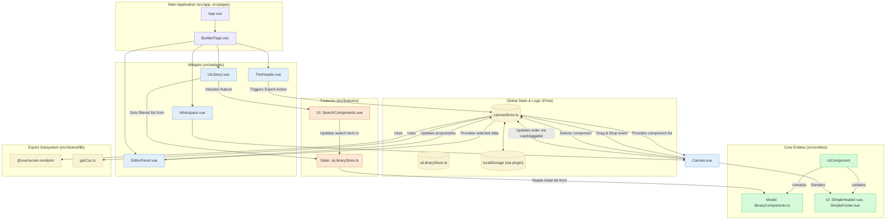

# Архитектура Приложения "Web Builder"

Этот документ описывает высокоуровневую архитектуру созданного нами веб-конструктора. Диаграмма иллюстрирует ключевые компоненты, их взаимодействие и потоки данных в приложении.

## UML Диаграмма (Mermaid)

## Описание Компонентов

### 1. Глобальное Состояние (Pinia)

-   **`canvasStore.ts`**: Мозг приложения, отвечающий за состояние холста. Хранит массив `componentInstances`, `selectedComponentInstanceId` и все `actions` для манипуляции с холстом.
-   **`uiLibraryStore.ts`**: Отвечает за состояние панели с компонентами. Хранит исходный список компонентов, поисковый запрос и предоставляет отфильтрованные и сгруппированные данные для виджета.
-   **`localStorage`**: Благодаря плагину `pinia-plugin-persistedstate`, состояние `canvasStore` автоматически сохраняется в `localStorage`, обеспечивая персистентность данных между сессиями.

### 2. Features (Фичи)

-   **`UiLibraryState`**: Логическая фича, реализованная в `uiLibraryStore.ts`. Является единым источником правды для библиотеки компонентов, инкапсулируя логику фильтрации и группировки.
-   **`UiLibrarySearch`**: UI-фича, представленная компонентом `SearchComponents.vue`. Предоставляет поле ввода для поиска и взаимодействует с `uiLibraryStore` для обновления состояния поиска.

### 3. Основные Виджеты (Widgets)

-   **`BuilderPage.vue`**: Главный компонент-оркестратор, формирующий базовую структуру приложения.
-   **`TheHeader.vue`**: Шапка приложения с кнопкой "Экспорт".
-   **`UiLibrary.vue`**: Левая панель. "Глупый" виджет-контейнер. Он не содержит бизнес-логики, а лишь включает в себя фичу `SearchComponents` и получает готовый к отображению список компонентов из `uiLibraryStore`.
-   **`Workspace.vue`**: Центральная область, содержащая `Canvas.vue`.
-   **`Canvas.vue`**: Холст для сборки страницы.
-   **`EditorPanel.vue` (refactored)**: Правая панель для редактирования свойств выбранного компонента. Этот виджет был полностью переработан и теперь является **полностью управляемым данными (data-driven)**. Он не содержит никакой логики, специфичной для отдельных компонентов. Вместо этого он:
    -   Получает данные о выбранном компоненте из `canvasStore`.
    -   Читает метаданные `editorTabs` из информации о компоненте.
    -   Динамически рендерит вкладки ("Content", "Styles") и поля для редактирования (`<input>`, `<textarea>` и т.д.) на основе этих метаданных.
    -   При изменении поля вызывает универсальные `actions` в `canvasStore` для обновления `props` или `styles`.
    -   Такой подход полностью соответствует **Принципу Открытости/Закрытости (OCP)**: для добавления редактирования нового компонента больше не нужно изменять код `EditorPanel`.

### 4. Сущности (Entities)

-   **`UiComponent`**: Ключевая бизнес-сущность. Её модель (`libraryComponents.ts` и `types.ts`) была расширена и теперь является **единственным источником правды** не только для самого компонента, но и для его редактора. Она включает:
    -   UI-представление (`.vue` файл).
    -   Пропсы и стили по умолчанию (`defaultProps`, `defaultStyles`).
    -   **`editorTabs`**: Структура метаданных, которая декларативно описывает, какие вкладки и поля должны быть отображены в `EditorPanel` для редактирования этого компонента.

## Потоки Данных (Data Flow)

1.  **Поиск и фильтрация компонентов**:
    -   Пользователь вводит текст в `SearchComponents.vue`.
    -   Компонент вызывает `action` `setSearchTerm` в `uiLibraryStore`.
    -   Реактивный `getter` `filteredGroupedComponents` в `uiLibraryStore` мгновенно пересчитывает сгруппированный список.
    -   `UiLibrary.vue`, будучи подписанным на этот `getter`, автоматически перерисовывается.

2.  **Добавление компонента**: Пользователь перетаскивает компонент из `UiLibrary.vue`. `Canvas.vue` "ловит" событие и вызывает `action` `addComponent` в `canvasStore`.

3.  **Выделение и Редактирование (new data-driven flow)**:
    -   Пользователь кликает на компонент в `Canvas.vue`, вызывая `action` `selectComponent` в `canvasStore`.
    -   `EditorPanel.vue` реактивно получает обновленный `selectedComponent` из `getter`-а `canvasStore`.
    -   Виджет читает массив `editorTabs` из `selectedComponent.componentInfo`.
    -   Используя цикл `v-for`, `EditorPanel` отрисовывает вкладки и, для активной вкладки, отрисовывает набор полей с помощью вспомогательного компонента `EditorControl.vue`. Каждому `EditorControl` передаются метаданные поля (название, тип) и его текущее значение из `store`.
    -   Когда пользователь изменяет значение в `EditorControl`, тот генерирует событие `update:modelValue`.
    -   `EditorPanel.vue` ловит это событие и вызывает соответствующий `action` (`updateComponentProps` или `updateComponentStyles`) в `canvasStore`, передавая `instanceId`, имя поля и новое значение.
    -   `canvasStore` обновляет свое состояние, и `Canvas.vue` автоматически перерисовывает измененный компонент.

4.  **Экспорт**: Клик по кнопке в `TheHeader.vue` вызывает асинхронный `action` `generateHtmlString` в `canvasStore`, который рендерит все компоненты в HTML-строку с помощью `@vue/server-renderer` и утилиты `getCss`.