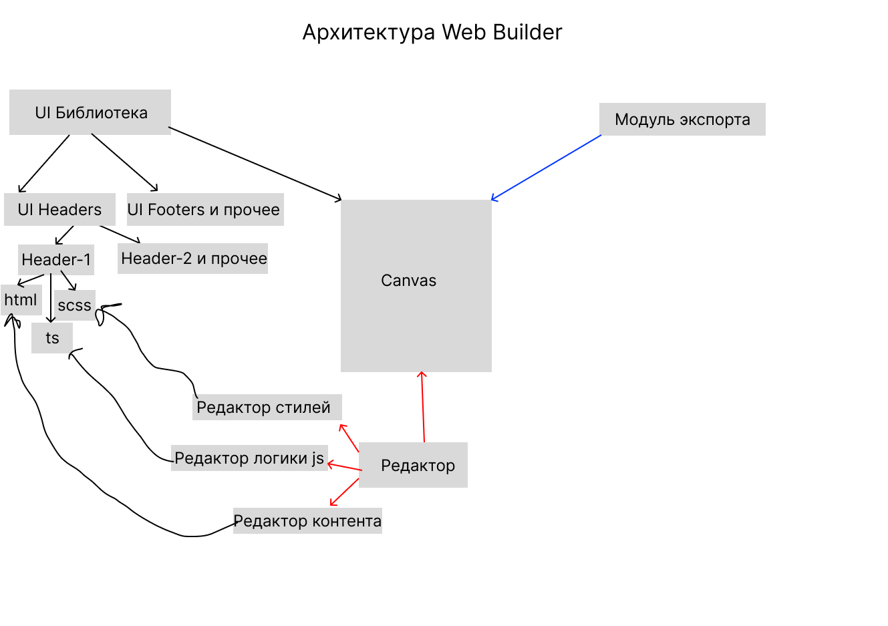

# Архитектура Приложения "Web Builder"

Этот документ описывает высокоуровневую архитектуру созданного нами веб-конструктора. Диаграмма иллюстрирует ключевые компоненты, их взаимодействие и потоки данных в приложении.

## UML Диаграмма (Mermaid)

```mermaid
graph TD
    subgraph "Global State & Logic (Pinia)"
        CanvasStore[("canvasStore.ts")]
        LibraryStore[("uiLibraryStore.ts")]
        Persist[("localStorage (via plugin)")]
        CanvasStore <--> Persist
    end

    subgraph "Features (src/features)"
        F_Search[UI: SearchComponents.vue]
        F_LibraryState(State: uiLibraryStore.ts)
        
        F_Search -- "Updates search term in" --> F_LibraryState
    end

    subgraph "Core Entities (src/entities)"
        E_Component[UiComponent]
        E_Model[Model: libraryComponents.ts]
        E_Vue[UI: SimpleHeader.vue, SimpleFooter.vue]
        
        E_Component -- "contains" --> E_Model
        E_Component -- "contains" --> E_Vue
    end
    
    subgraph "Main Application (src/app, src/pages)"
        App[App.vue] --> Page[BuilderPage.vue]
    end

    subgraph "Widgets (src/widgets)"
        Page --> Header[TheHeader.vue]
        Page --> Library[UiLibrary.vue]
        Page --> Workspace[Workspace.vue]
        Page --> Editor[EditorPanel.vue]
    end

    subgraph "Export Subsystem (src/shared/lib)"
        ExportRenderer["@vue/server-renderer"]
        ExportCSS["getCss.ts"]
    end

    Workspace --> Canvas[Canvas.vue]

    %% Data Flow & Interactions
    F_LibraryState -- "Reads initial list from" --> E_Model
    Library -- "Includes feature" --> F_Search
    Library -- "Gets filtered list from" --> F_LibraryState
    
    Canvas -- "Drag & Drop event" --> CanvasStore
    CanvasStore -- "Provides component list" --> Canvas
    Canvas -- "Renders" --> E_Vue
    Canvas -- "Selects component" --> CanvasStore
    
    CanvasStore -- "Provides selected data" --> Editor
    Editor -- "Updates props/styles" --> CanvasStore
    
    Canvas -- "Updates order via vuedraggable" <--> CanvasStore
    
    Header -- "Triggers Export Action" --> CanvasStore
    CanvasStore -- "Uses" --> ExportRenderer
    CanvasStore -- "Uses" --> ExportCSS

    %% Styling
    classDef widget fill:#e1effa,stroke:#a6c5e3,stroke-width:2px;
    classDef entity fill:#d5fada,stroke:#93e3a4,stroke-width:2px;
    classDef store fill:#f9f3d5,stroke:#e3d593,stroke-width:2px;
    classDef feature fill:#fce8d5,stroke:#e3b593,stroke-width:2px;
    
    class Header,Library,Workspace,Editor,Canvas widget
    class E_Component,E_Model,E_Vue entity
    class CanvasStore,LibraryStore,Persist,ExportRenderer,ExportCSS store
    class F_Search, F_LibraryState feature
```

## Описание Компонентов

### 1. Глобальное Состояние (Pinia)

-   **`canvasStore.ts`**: Мозг приложения, отвечающий за состояние холста. Хранит массив `componentInstances`, `selectedComponentInstanceId` и все `actions` для манипуляции с холстом.
-   **`uiLibraryStore.ts` (new)**: Отвечает за состояние панели с компонентами. Хранит исходный список компонентов, поисковый запрос и предоставляет отфильтрованные и сгруппированные данные для виджета.
-   **`localStorage`**: Благодаря плагину `pinia-plugin-persistedstate`, состояние `canvasStore` автоматически сохраняется в `localStorage`, обеспечивая персистентность данных между сессиями.

### 2. Features (Фичи)

-   **`UiLibraryState`**: Логическая фича, реализованная в `uiLibraryStore.ts`. Является единым источником правды для библиотеки компонентов, инкапсулируя логику фильтрации и группировки.
-   **`UiLibrarySearch`**: UI-фича, представленная компонентом `SearchComponents.vue`. Предоставляет поле ввода для поиска и взаимодействует с `uiLibraryStore` для обновления состояния поиска.

### 3. Основные Виджеты (Widgets)

-   **`BuilderPage.vue`**: Главный компонент-оркестратор, формирующий базовую структуру приложения.
-   **`TheHeader.vue`**: Шапка приложения с кнопкой "Экспорт".
-   **`UiLibrary.vue` (refactored)**: Левая панель. Теперь это "глупый" виджет-контейнер. Он не содержит бизнес-логики, а лишь:
    -   Включает в себя фичу `SearchComponents`.
    -   Получает готовый к отображению, отфильтрованный список компонентов из `uiLibraryStore`.
    -   Отображает этот список.
-   **`Workspace.vue`**: Центральная область, содержащая `Canvas.vue`.
-   **`Canvas.vue`**: Холст для сборки страницы.
-   **`EditorPanel.vue`**: Правая панель для редактирования свойств выбранного компонента.

### 4. Сущности (Entities)

-   **`UiComponent`**: Ключевая бизнес-сущность, объединяющая в себе модель (`libraryComponents.ts`) и UI-представление (`.vue` файлы).

## Потоки Данных (Data Flow)

1.  **Поиск и фильтрация компонентов (new)**:
    -   Пользователь вводит текст в `SearchComponents.vue`.
    -   Компонент вызывает `action` `setSearchTerm` в `uiLibraryStore`.
    -   Реактивный `getter` `filteredGroupedComponents` в `uiLibraryStore` мгновенно пересчитывает сгруппированный список на основе нового поискового запроса.
    -   `UiLibrary.vue`, будучи подписанным на этот `getter`, автоматически перерисовывается, отображая только подходящие компоненты.

2.  **Добавление компонента**: Пользователь перетаскивает компонент из `UiLibrary.vue`. `Canvas.vue` "ловит" событие и вызывает `action` `addComponent` в `canvasStore`.

3.  **Выделение и Редактирование**: Клик на компоненте в `Canvas.vue` вызывает `action` `selectComponent` в `canvasStore`. `EditorPanel.vue` получает данные из `getter`-а и при изменении полей отправляет `actions` на обновление `props` или `styles` обратно в `canvasStore`.

4.  **Экспорт**: Клик по кнопке в `TheHeader.vue` вызывает асинхронный `action` `generateHtmlString` в `canvasStore`, который рендерит все компоненты в HTML-строку с помощью `@vue/server-renderer` и утилиты `getCss`.

